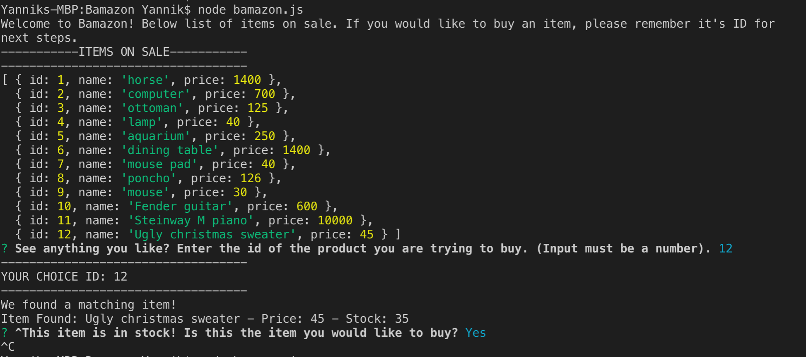

# Bamazon
A store app that lets users buy items. This is a node application that uses a mySQL database. 

## How to Use Bamazon
When the user opens the node application, it will immediately show them a list of the products currently on sale. The user is meant to browse through this list of products and remember the id of the product that they are interested in buying.

Once they have an item in mind:
* They will answer the first prompt by inputting the id of the product they are trying to buy

* If the product they are trying to buy exists, the application will proceed with the purchase.

* If the item is out of stock, the user will be prompted to submit another id or exit

