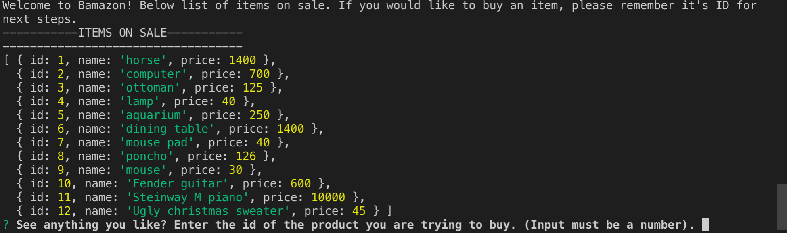
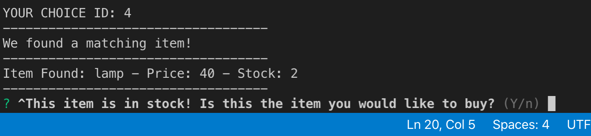
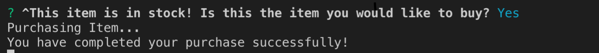
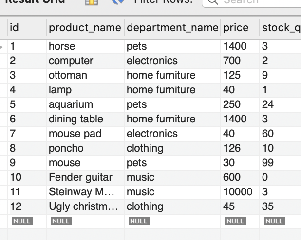
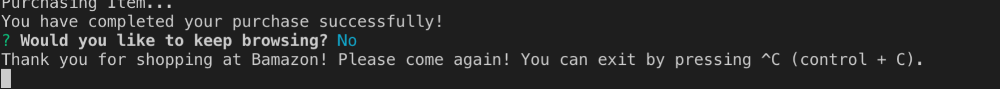

# Bamazon
A store app that lets users buy items. This is a node application that uses a mySQL database. 

## How to Use Bamazon
The user first needs to start the node application. Inside the bamazon.js directory, the user will type the following into the command line:

```
    node bamazon.js
```

The application will then automatically open and show the user the list of items currently on sale.



Once the user has an item in mind:
* They will answer the first prompt by inputting the _id_ of the product they are trying to buy. If the product exists, the application will display its name, price and stock quantity.

    * If the product they are trying to buy exists and is in stock, the application will proceed with the purchase. In the following example, the user purchases a lamp. <br><br>We see that there are only 2 in stock. If the user confirms the purchase, we can check our mySQL table and see that there is only 1 left in stock once the purchase has been processed.

    

    

    


    * If the item is out of stock, the user will be prompted to submit another id or exit


    ## Exiting the Application

    Whether the user has decided to buy the item or not, they will be asked if they would like to continue browsing. 
    
    * If they answer yes, the "start()" function will be executed and they will be able to start over

    * If they answer no, the console will let them know how to exit the application:

    


